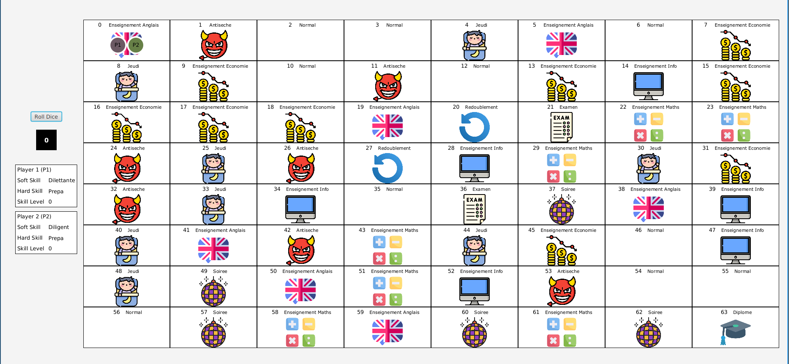

[](https://www.ensicaen.fr)

MyEnsicaenLife
================



## Members

This project has been realised by a 8-members team including Romaric JOLLIVER as the project manager, Hamza EL KILALI as the project's architect and Arthur FESSARD as the responsible of the version
The rest of the team had a developper role (which the three people mentionned above also had)

## Description

This project aims to produce an alternative version of the very popular board game, "the game of the goose".
We had to revisit it to make it a game that represented a school course at ENSICAEN.
That's why we decided to name our game: "my ensicaen life".
All this had to be coded in Java, while using the JavaFX Framework for the GUI.
The goal of this project is to make us apply what we learned during our software engineering courses.
We had 6 two-hour sessions to complete this project.

## Start the game

To launch the game, run the following command from the root of the project:

```bash
./gradlew run
```
